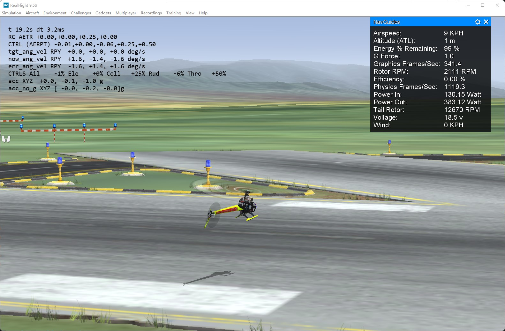
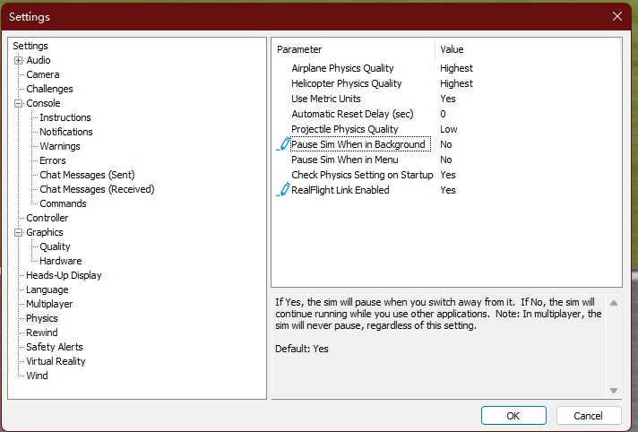

# Introduction
This is my bridge from [Realflight Simulator](https://www.realflight.com/) (the commerical simulator) via [FlightAxis Link](http://flightaxis.com/) to Flight Controllers.
The software is for testing flight controller.

# Pre-request
Purchase RealFlight 9 (or higher) from [Steam](https://store.steampowered.com/app/1070820/RealFlight_95S/) or [Offical website](https://www.realflight.com/).

Set-up the settings for Realflight 9 [as](https://www.knifeedge.com/forums/index.php?threads/flightaxis-link-in-realflight-9.33981/):
- Click Simulation>Settings.
- Select Physics from the list in the left pane.
- In the right pane, set "FlightAxis Link Enabled" to "Yes".
- Set "Pause Physics When in Background" to "No".
- Restart RealFlight.

# Protocol
The detailed protocol for Realflight (FlightAxis Link) is summarized in [doc](./docs/realflight_protocol.md).